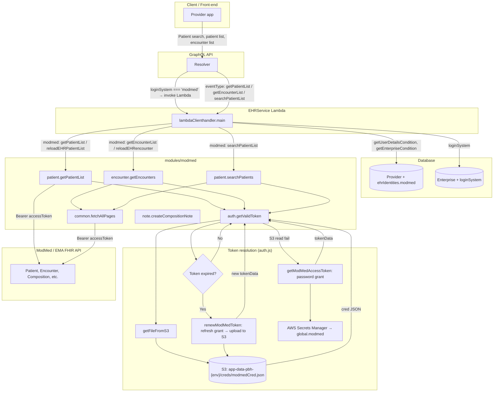
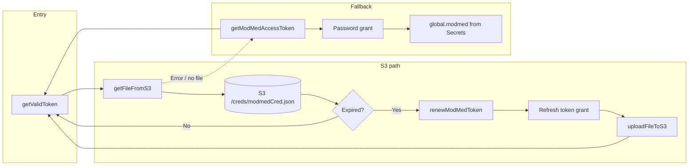
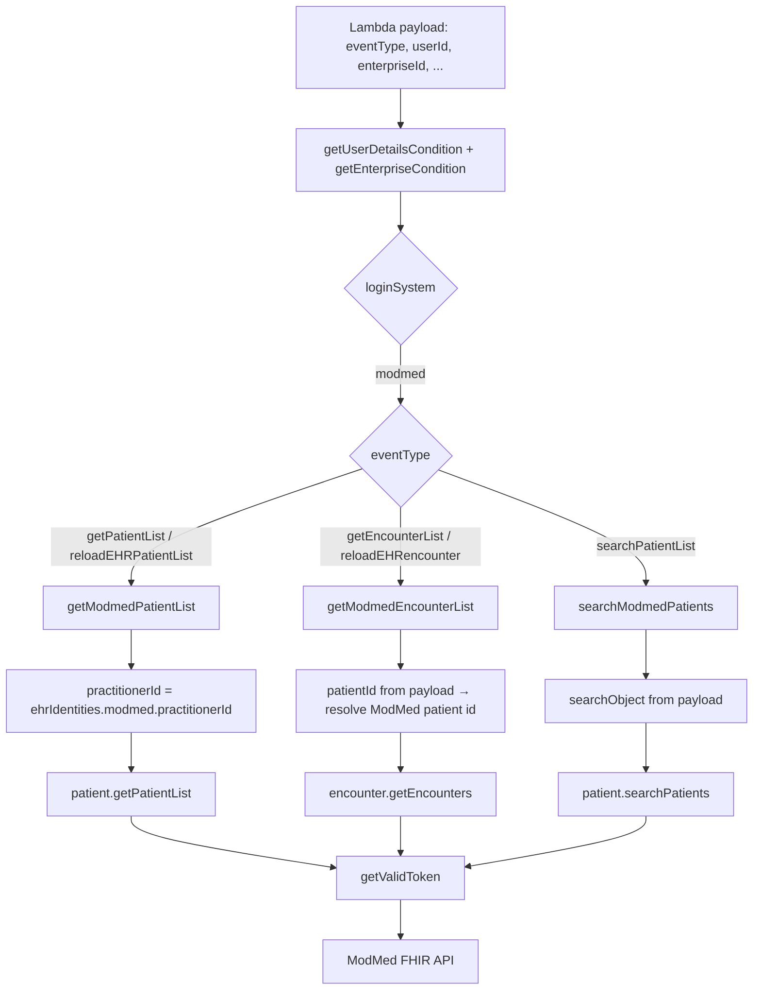
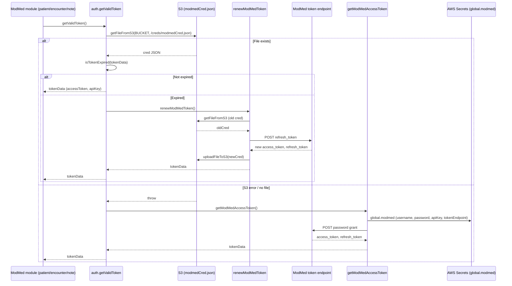
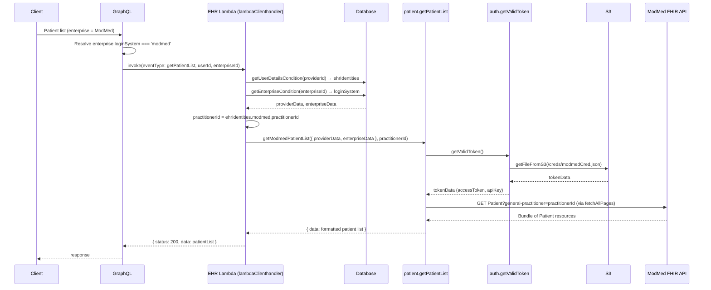
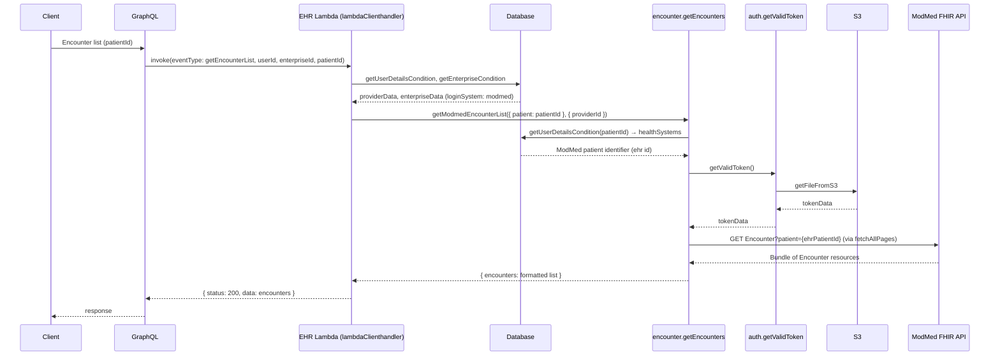
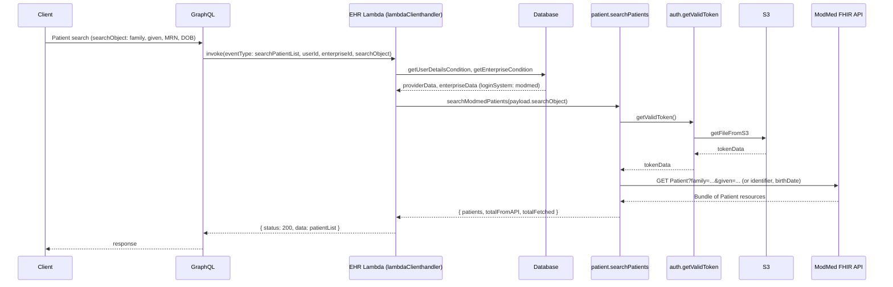
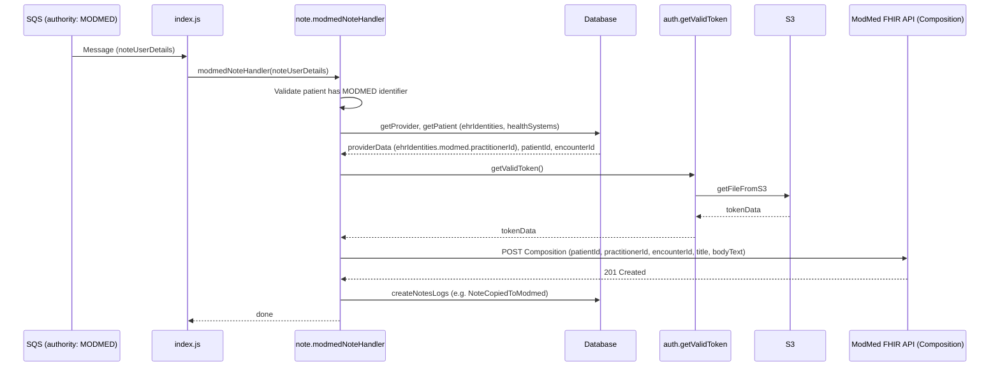
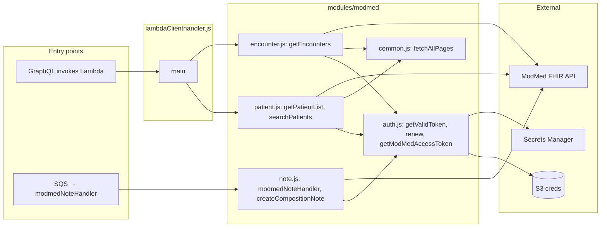

# ModMed Integration — Diagrams (EHRService)

Mermaid diagrams for the ModMed EHR integration: token flow (S3), Lambda routing, GraphQL delegation, and note ingestion.

---

## 1. High-level architecture (flowchart)

End-to-end flow: Client → GraphQL → EHR Lambda → ModMed module → S3/Secrets and ModMed FHIR API.

---

## 2. Token resolution flow (flowchart)

How `getValidToken()` in `auth.js` obtains the access token: S3 read → expire check → refresh or password grant.

---

## 3. Lambda event routing (flowchart)

How `lambdaClienthandler.main` routes by `eventType` and `loginSystem` to ModMed functions.

---

## 4. Sequence: getValidToken (S3 read, refresh, or password grant)

---

## 5. Sequence: GraphQL → Lambda → getPatientList (ModMed)

---

## 6. Sequence: GraphQL → Lambda → getEncounterList (ModMed)

---

## 7. Sequence: GraphQL → Lambda → searchPatientList (ModMed)

---

## 8. Sequence: Note ingestion (SQS → modmedNoteHandler)

---

## 9. Component overview (flowchart)

Where ModMed-related code lives and how it connects.

---

_For cross-repo context (onboarding, GraphQL delegation, database schema), see `integration.md`._
