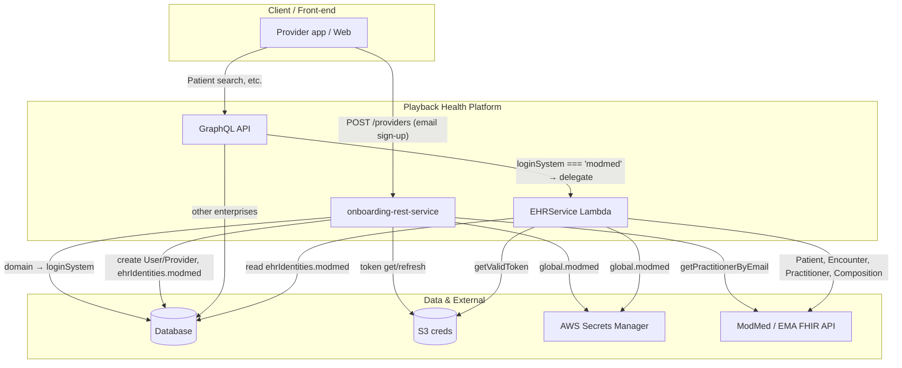
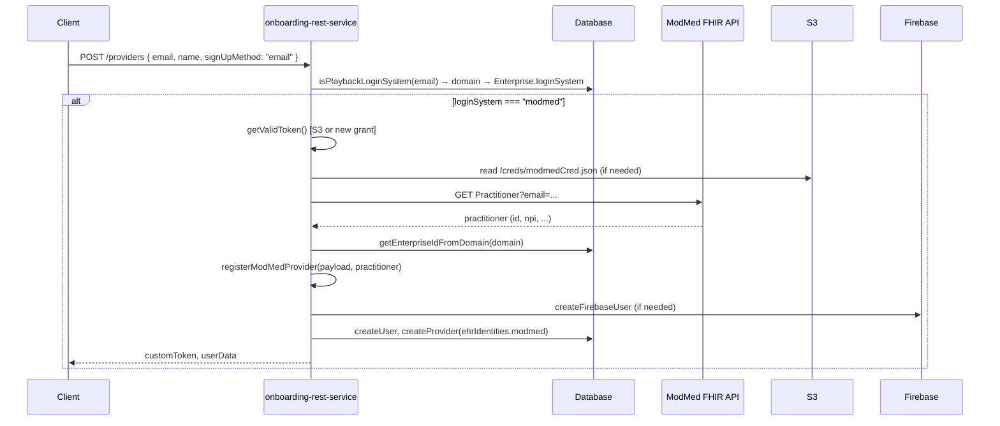
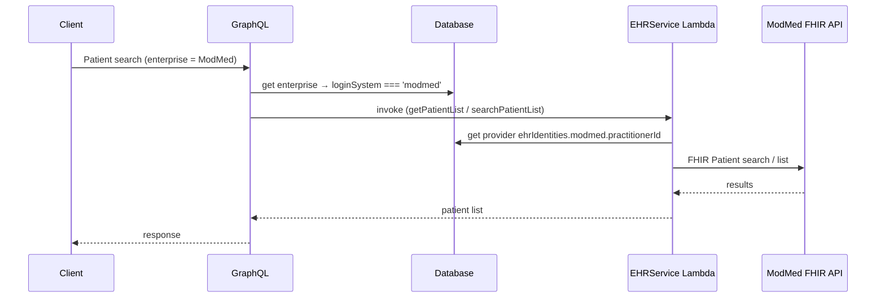

# ModMed EHR Integration (Cross-Repository)

**Audience:** Engineering, Product  
**Last updated:** March 2025
---

## 1. Overview

ModMed (EMA API) is integrated as an **enterprise login system** across multiple Playback Health repositories. Providers in ModMed-configured enterprises can sign up and use EHR-backed features (patient search, encounters, appointments, notes) via a shared EHR Lambda path instead of local DB lookups.

This document describes the **full cross-repo integration**: the meaning of the ModMed flag, database schema, and each repository’s role.

---

## 2. The ModMed Flag: `enterprise.loginSystem === 'modmed'`

Across the platform, **`enterprise.loginSystem === 'modmed'`** means:

| Context | Meaning |
|--------|----------|
| **Onboarding REST Service** | For provider sign-up by email: use ModMed path (practitioner lookup + register with `ehrIdentities.modmed`). |
| **EHRService (Lambda)** | Use ModMed FHIR APIs for patient list, encounter list, patient search, and note ingestion for this enterprise. |
| **GraphQL (and clients)** | **Run patient search through the shared EHR Lambda (ModMed/Epic/NextGen path) instead of the local DB.** For ModMed customers, this flag enables **delegated patient-search behavior**: the GraphQL layer routes patient-search requests to the EHR Lambda rather than querying the local database. |

In short: the flag both **identifies** ModMed enterprises and **enables** delegated EHR behavior (including patient search via the shared Lambda) for those customers.

---

## 3. Database: `ehrIdentities` Column

The **database** repository introduces storage for EHR-specific provider identities:

| Item | Details |
|------|---------|
| **Column** | `ehrIdentities` (on the Provider entity / table used for provider records) |
| **Creation** | Added via **migrations** in the database repo. |
| **Purpose** | Stores per-EHR identity data so that each service (EHRService Lambda, onboarding, etc.) can use the correct external IDs when calling ModMed, Epic, or NextGen. |

**Shape (ModMed):**  
When a provider is registered via the ModMed path (onboarding-rest-service), the provider record is created/updated with:

```json
{
  "modmed": {
    "practitionerId": "<ModMed FHIR Practitioner id>",
    "npi": "<NPI if available>"
  }
}
```

Other EHRs (Epic, NextGen) may use the same `ehrIdentities` column with their own keys (e.g. `epic`, `nextgen`). The EHRService Lambda and GraphQL use `ehrIdentities.modmed.practitionerId` (and equivalent for other systems) when delegating to the shared EHR path.

---

## 4. Repository Summary

| Repository | ModMed-related responsibility |
|------------|-------------------------------|
| **onboarding-rest-service** | Provider registration for ModMed enterprises; practitioner lookup by email; token acquisition/refresh (S3); writes `ehrIdentities.modmed` on Provider. |
| **EHRService** | FHIR API integration: patient list, encounter list, patient search, note ingestion; token lifecycle; uses `ehrIdentities.modmed.practitionerId` and `enterprise.loginSystem === 'modmed'`. |
| **GraphQL** | When `enterprise.loginSystem === 'modmed'`, routes patient search to the **shared EHR Lambda** (ModMed/Epic/NextGen path) instead of the local DB. |
| **Database** | Schema: **`ehrIdentities`** column on Provider, added via migrations; used by onboarding and EHRService to store/read ModMed (and other EHR) identities. |

---

## 5. Architecture Diagram

### 5.1 High-level (Mermaid)

*If your Confluence has a Mermaid macro, paste the code below into it. Otherwise use the ASCII diagram in the next section.*



### 5.2 High-level (ASCII)

```
                    ┌─────────────────────────────────────────────────────────────────┐
                    │                      Client / Front-end                          │
                    └─────────────────────────────────────────────────────────────────┘
                      │ POST /providers (email)              │ Patient search, etc.
                      ▼                                      ▼
    ┌─────────────────────────────────┐      ┌─────────────────────────────────────────┐
    │   onboarding-rest-service        │      │            GraphQL API                    │
    │   • Resolve loginSystem by domain │      │   loginSystem === 'modmed'                │
    │   • getPractitionerByEmail        │      │   → delegate to EHR Lambda (no local DB) │
    │   • registerModMedProvider       │      └─────────────────────────────────────────┘
    │   • storeUserInDb → ehrIdentities│                          │
    └─────────────────────────────────┘                          │
      │         │              │                                  ▼
      │         │              │               ┌─────────────────────────────────────────┐
      │         │              │               │         EHRService (Lambda)              │
      │         │              │               │   getPatientList, getEncounterList,       │
      │         │              │               │   searchPatientList, modmedNoteHandler    │
      │         │              │               │   Uses ehrIdentities.modmed.practitionerId│
      │         │              │               └─────────────────────────────────────────┘
      │         │              │                                  │
      ▼         ▼              ▼                                  ▼
    ┌──────────┐ ┌────┐ ┌──────────────┐              ┌──────────────────────┐
    │ Database │ │ S3 │ │ ModMed/EMA    │◄─────────────│ ModMed/EMA FHIR API   │
    │ Enterprise│ │creds│ │ Secrets      │              │ Patient, Encounter,   │
    │ Provider  │ │    │ │ Manager      │              │ Practitioner, Note    │
    │ ehrIdentities│    │ │              │              └──────────────────────┘
    └──────────┘ └────┘ └──────────────┘
```

### 5.3 ModMed provider sign-up flow (sequence)



### 5.4 Patient search delegation (GraphQL → EHR Lambda)



---

## 6. Onboarding REST Service

**Repo:** `onboarding-rest-service`

### 6.1 Role

- Provider **registration** when sign-up is by email and the provider’s domain is tied to an enterprise with `loginSystem: "modmed"`.
- **Practitioner lookup** by email via ModMed (EMA) FHIR API.
- **Token management**: obtain and refresh ModMed tokens; persist in S3 at `/creds/modmedCred.json` (bucket `app-data-pbh-{APP_ENV}`).

### 6.2 Configuration

Secrets (AWS Secrets Manager) → `global.modmed` in `config/index.js`:

| Secret key | Purpose |
|------------|---------|
| `MODMED_TOKEN_ENDPOINT` | OAuth2 token URL (password grant) |
| `MODMED_API_KEY` | API key (`x-api-key` header) |
| `MODMED_USERNAME` | Password-grant username |
| `MODMED_PASSWORD` | Password-grant password |

### 6.3 Flow (ModMed sign-up)

1. Client calls **`POST /providers`** with `signUpMethod: "email"`, `email`, `name`, etc.
2. Service resolves **login system** by email domain → `isPlaybackLoginSystem(email)`. If `loginSystem === "modmed"`:
3. **`getPractitionerByEmail(email)`** (module/modmed) → ModMed FHIR `Practitioner?email=...`. If none found → invalid email.
4. **`registerModMedProvider(payload, practitioner)`** → resolve enterprise by domain, then **`storeUserInDb`** with practitioner.
5. **`storeUserInDb`** creates User/Provider (Firebase, Playback DB) and sets **`ehrIdentities.modmed = { practitionerId, npi }`** on the Provider.

### 6.4 Key files

| Path | Purpose |
|------|---------|
| `config/index.js` | Sets `global.modmed` from secrets. |
| `services/provider.js` | Provider handler; branches to ModMed when `loginSystem === "modmed"`. |
| `module/modmed/index.js` | Exports `registerModMedProvider`, `getPractitionerByEmail`. |
| `module/modmed/register.js` | `registerModMedProvider`: enterprise resolution + `storeUserInDb`. |
| `module/modmed/auth.js` | `getModMedAccessToken`, `renewModMedToken`, `getValidToken` (S3-backed). |
| `module/modmed/practitioner.js` | `getPractitionerByEmail`: FHIR Practitioner by email. |
| `module/publicProvider/action.js` | `storeUserInDb`: creates User/Provider and sets `ehrIdentities.modmed`. |
| `common/database.js` | `isPlaybackLoginSystem`: domain → Enterprise → `loginSystem` (e.g. `"modmed"`). |

---

## 7. EHRService Repository

**Repo:** `EHRService`

### 7.1 Role

FHIR-based integration with ModMed (EMA API): patients, encounters, appointments, practitioners, and clinical notes. Used by the **shared EHR Lambda** that GraphQL (and other clients) call when `enterprise.loginSystem === 'modmed'` (and for Epic/NextGen when applicable).

### 7.2 Repository layout (ModMed)

```
EHRService/
├── config/config.js              # global.modmed from secrets
├── index.js                       # SQS handler → modmedNoteHandler for MODMED authority
├── lambdaClienthandler.js         # Lambda: getPatientList, getEncounterList, searchPatientList (modmed)
└── modules/modmed/
    ├── index.js                   # Public exports
    ├── auth.js                    # getValidToken, renew, getModMedAccessToken
    ├── common.js                  # fetchAllPages (FHIR bundle pagination)
    ├── appointment.js             # getAppointments
    ├── encounter.js               # getEncounterById, getEncounters
    ├── patient.js                 # getPatientById, getPatientList, searchPatients
    ├── practitioner.js           # getPractitionerByEmail
    ├── note.js                    # createCompositionNote, modmedNoteHandler
    └── t/modmed-api.test.js      # Optional integration test
```

### 7.3 Configuration

Secrets → `global.modmed` in `config/config.js`:

| Secret / config key | Purpose |
|---------------------|---------|
| `MODMED_BASE_URL` | Base API URL (e.g. `https://stage.ema-api.com/ema-dev/firm`) |
| `MODMED_FIRM_URL_PREFIX` | Firm/tenant prefix (e.g. `dermpmsandbox286`) |
| `MODMED_TOKEN_ENDPOINT` | OAuth token endpoint |
| `MODMED_API_KEY` | API key for token and FHIR |
| `MODMED_USERNAME` / `MODMED_PASSWORD` | Password-grant credentials |

**FHIR base URL:** `{MODMED_BASE_URL}/{MODMED_FIRM_URL_PREFIX}/ema/fhir/v2`.  
**Credentials cache:** S3 `/creds/modmedCred.json` in bucket `app-data-pbh-{APP_ENV}`.

### 7.4 Lambda handler (client-facing)

`lambdaClienthandler.js` routes by `eventType` and `loginSystem`. When `loginSystem === "modmed"`:

| eventType | Behavior |
|-----------|----------|
| **getPatientList** / **reloadEHRPatientList** | Uses `providerData.ehrIdentities.modmed.practitionerId`; returns patient list for that practitioner. |
| **getEncounterList** / **reloadEHRencounter** | Uses `payload.patientId`; returns encounter list for that patient. |
| **searchPatientList** | Uses `payload.searchObject`; calls ModMed patient search (e.g. family name, MRN, DOB, name). |

Provider must have `ehrIdentities.modmed.practitionerId`; enterprise must have `loginSystem: "modmed"`.

### 7.5 Note ingestion (SQS)

When SQS message authority is **MODMED**, `index.js` invokes **`modmedNoteHandler(noteUserDetails)`** (`note.js`):

1. Validate patient has identifier with `authority === "MODMED"` and get ModMed patient ID.
2. Load provider and read `ehrIdentities.modmed.practitionerId`.
3. **createCompositionNote**: patientId, practitionerId, encounterId, title, bodyText, instructionsText.
4. POST Composition to ModMed FHIR; log via `createNotesLogs` (e.g. `NoteCopiedToModmed`).

### 7.6 Dependencies

Database (provider/enterprise, note logs), AWS Secrets Manager, S3 for token cache, `global.modmed` set at startup.

### 7.7 ModMed integration flow (EHRService)

Flowcharts and sequence diagrams for accessToken (S3/refresh/password grant), GraphQL → Lambda routing, and ModMed function calls are in **[diagrams.md](./diagrams.md)**. That file includes:

- High-level architecture flowchart
- Token resolution flowchart (getValidToken, S3, renew, password grant)
- Lambda event routing flowchart
- Sequence: getValidToken (S3 read, refresh, or password grant)
- Sequence: GraphQL → Lambda → getPatientList
- Sequence: GraphQL → Lambda → getEncounterList
- Sequence: GraphQL → Lambda → searchPatientList
- Sequence: Note ingestion (SQS → modmedNoteHandler)
- Component overview flowchart

---

## 8. GraphQL Repository

**Repo:** GraphQL API / gateway

When **`enterprise.loginSystem === 'modmed'`**, the GraphQL layer treats the enterprise as using the **shared EHR Lambda** for patient search:

- **Patient search** is **not** run against the local DB.
- It is **delegated** to the EHR Lambda (ModMed/Epic/NextGen path).
- This is the flag that **enables delegated patient-search behavior** for ModMed customers.

(Implementation details of the GraphQL resolver and how it invokes the Lambda are specific to the GraphQL repo.)

---

## 9. Database Repository

**Repo:** Database / schema / migrations

- **`ehrIdentities`** column was **added via migrations** on the Provider entity (or equivalent table storing provider records).
- This column holds JSON (or equivalent) for per-EHR identities, e.g.:
  - **ModMed:** `ehrIdentities.modmed.practitionerId`, `ehrIdentities.modmed.npi`
  - Other EHRs may use `epic`, `nextgen`, etc.
- **Onboarding-rest-service** writes `ehrIdentities.modmed` when registering a provider through the ModMed path.
- **EHRService** (and any other consumer) reads `ehrIdentities.modmed.practitionerId` (and similar for other EHRs) when calling the EHR APIs.

---

## 10. End-to-End Flow (ModMed)

1. **Enterprise** is configured with `loginSystem: "modmed"` and domain mapping (outside these repos or in admin).
2. **Provider sign-up (onboarding-rest-service):** Email domain → ModMed path → practitioner lookup → `storeUserInDb` → Provider created with **`ehrIdentities.modmed`** (persisted in DB via **ehrIdentities** column from database repo migrations).
3. **Patient search (GraphQL):** For that enterprise, `loginSystem === 'modmed'` → route to **shared EHR Lambda** → EHRService ModMed path → FHIR patient search (no local DB patient search).
4. **Patient list / encounters / notes (EHRService):** Lambda uses `ehrIdentities.modmed.practitionerId` and ModMed FHIR for lists, encounters, and SQS note ingestion.

---