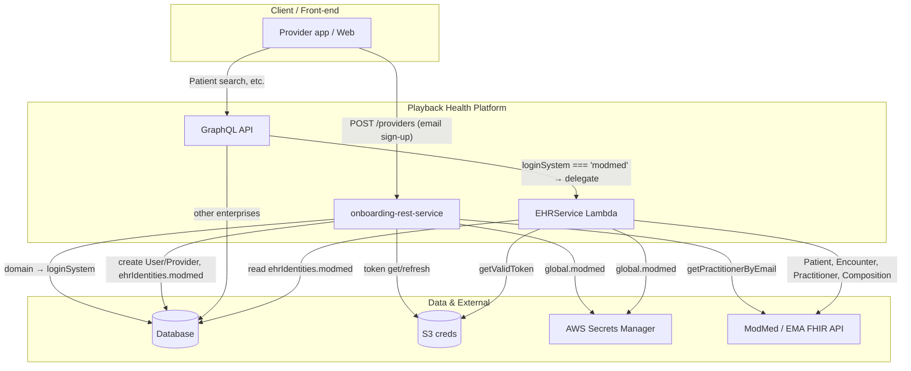
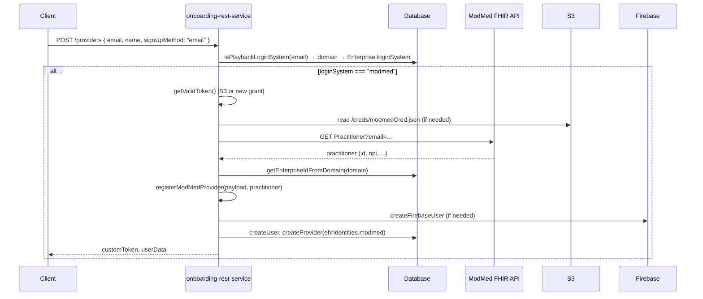
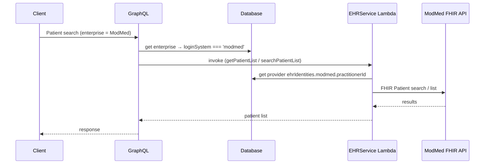
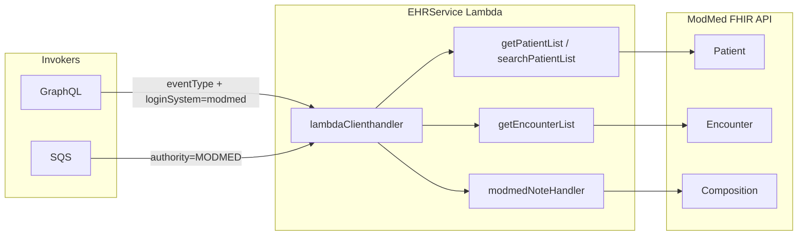
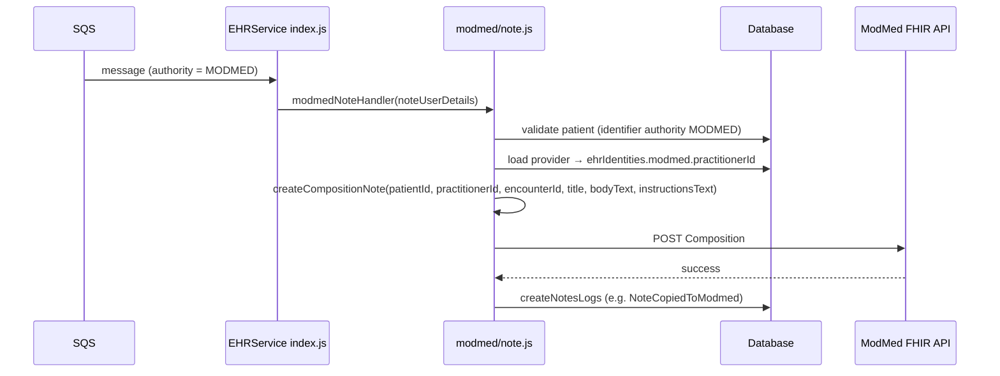
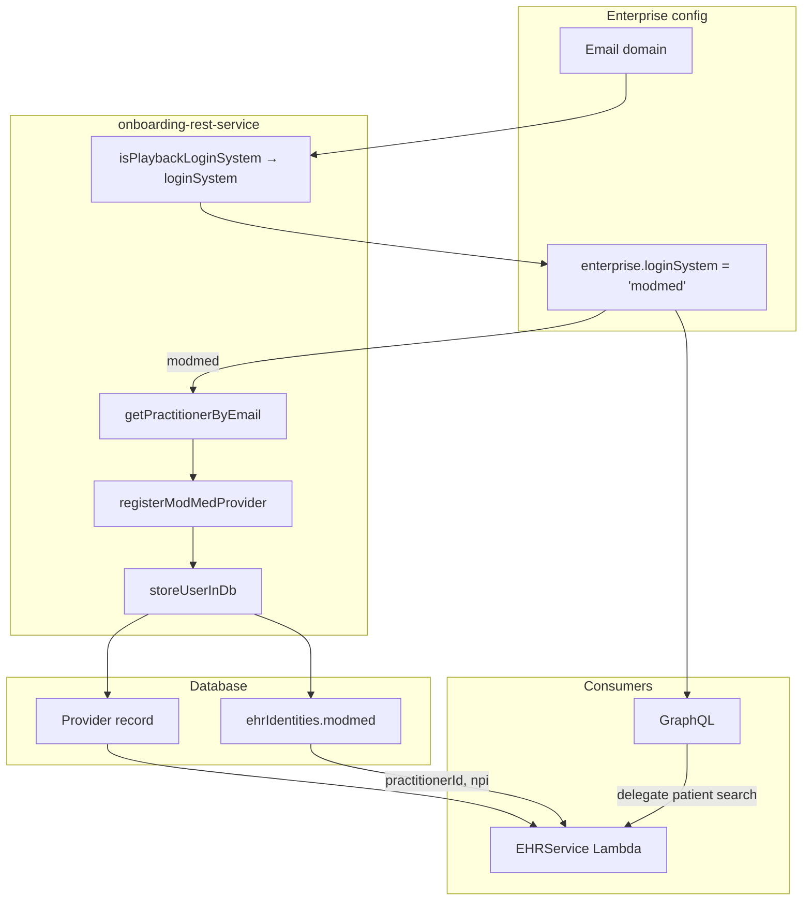
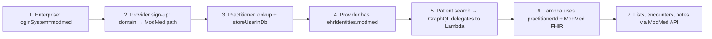

# ModMed Flow Diagrams

Reference: [ModMed-EHR-Integration.md](./ModMed-EHR-Integration.md)

---

## 1. High-level architecture

---

## 2. ModMed provider sign-up flow

---

## 3. Patient search delegation (GraphQL → EHR Lambda)

---

## 4. EHR Lambda operations (ModMed path)

---

## 5. Note ingestion flow (SQS → ModMed)

---

## 6. ehrIdentities and loginSystem flow

---

## 7. End-to-end ModMed flow (simplified)

---

_Diagrams use Mermaid. Render in GitHub, Confluence (Mermaid macro), or any Mermaid-compatible viewer._
